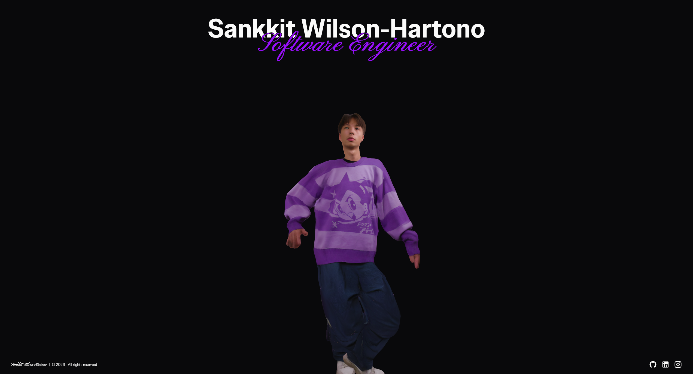

# Sankkit Wilson-Hartono — Portfolio Website

My personal portfolio, a very simple 3d model dancing with links to my social medias. Built with [SvelteKit](https://kit.svelte.dev/) and deployed as a static site on GitHub Pages.

🔗 **Live site:** [sankkitwilson.dev](https://sankkitwilson.dev)



## Tech Stack

- [SvelteKit](https://kit.svelte.dev/) — framework
- [Svelte](https://svelte.dev/) — UI
- [`@sveltejs/adapter-static`](https://kit.svelte.dev/docs/adapter-static) — prerenders the site for GitHub Pages

## Features

- 3D model of myself dancing.
- Fully static, no backend, fast page loads.

## Local Development

Requires [Node.js](https://nodejs.org/) (LTS recommended).

```sh
# Install dependencies
npm i

# Run the development server
npm run dev

# Build for production
npm run build

# Preview the production build locally
npm run preview
```

## Deployment

This site is prerendered as a static site (via `adapter-static`) and deployed to GitHub Pages automatically via a GitHub Actions workflow on push to `main`.

## Project Structure

```
src/
├── routes/     # Pages
├── lib/        # Reusable components, assets, utils
└── app.html    # App shell
static/         # GLB model files

```
